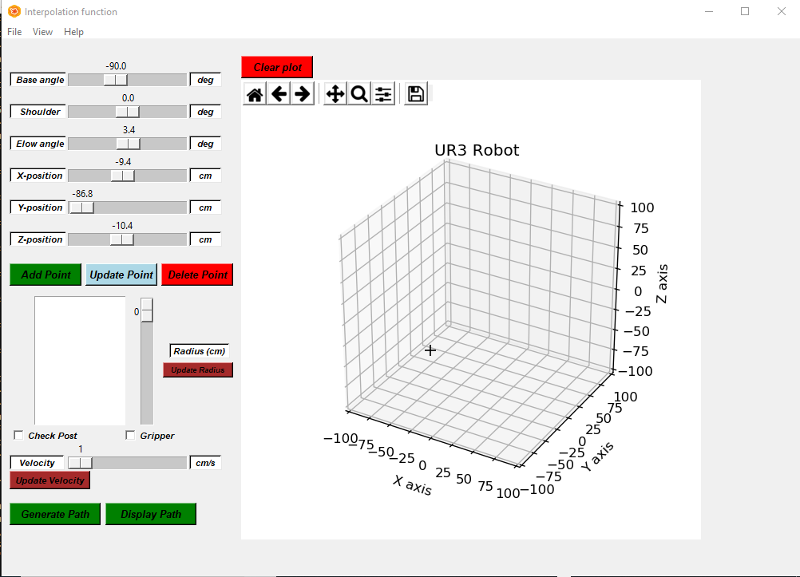
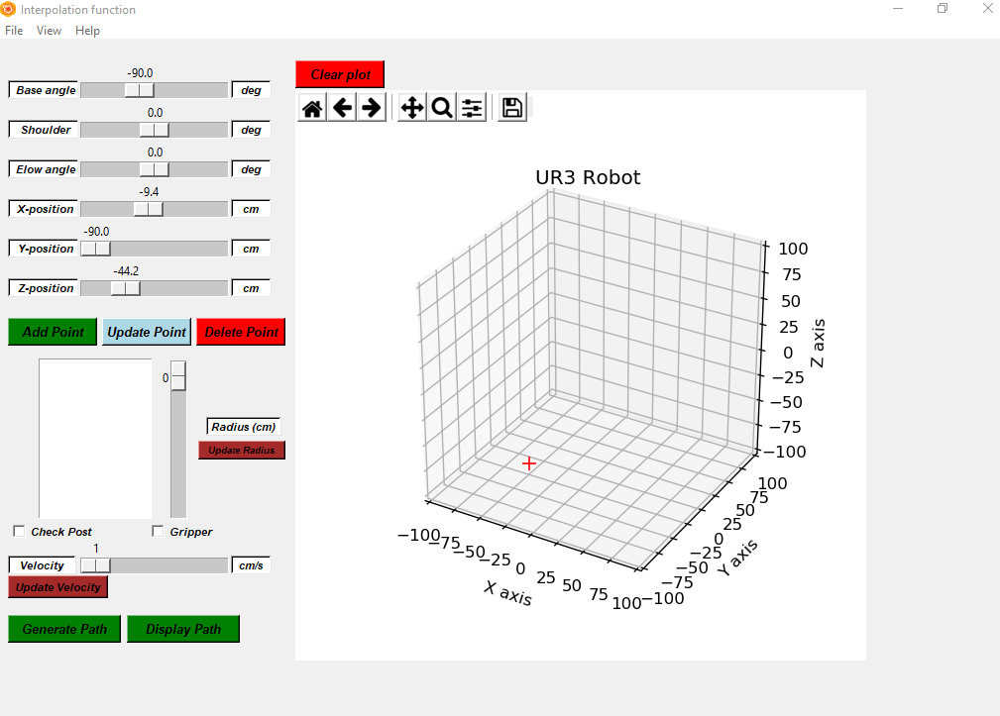
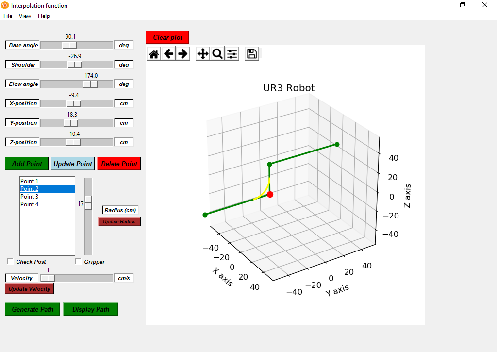
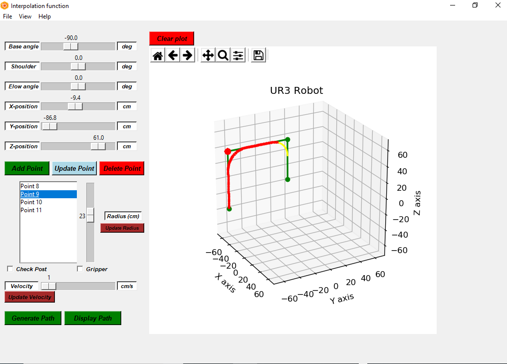

# Path Planner
Python GUI for path planning
## Requirements
* Matplotlib : Version '2.2.3' (Code :  import matplotlib; matplotlib.\_\_version\_\_) : Most Important library make sure version is same else error would be thrown. Code for installation : pip uninstall matplotlib , pip install -I matplotlib==2.2.3
* Numpy : Version : '1.16.4' (Code :  import numpy; numpy.\_\_version\_\_)
* Tkinter : Version : '8.6' (Code :  import tkinter; tkinter.TkVersion)
* Sympy : Version : '1.4' (Code :  import sympy; sympy.\_\_version\_\_)
## Code Structure
* All files corresponding to the .py, .ipynb extension are the code files. The .pkl file is the saved path file which can be opened using the GUI.
* PathPlanning.py file is the main file which need to be run. Upon running this file a GUI would open.
* Clicking on the File/Open menu, selecting the path file will load the points into the GUI.
## User Interface
Below is the GUI that appears when pathplanning.py is executed. The default position of the cursor is the home position. As the slider is moved beyond the workspace of the robot the cursor becomes red as can be seen below.  

        
 
<!-- -->

Clicking x/y/z-position will force the cursor back to home position. The points can be added, updated deleted until desried path is accomplished. Radius can be added to corners to smoothen motion as displayed in the image below. 

   
 
 

 Finally clicking on generate path would display generate the path and display infeasible paths if any on the UI as hown below. 
  

   
 
